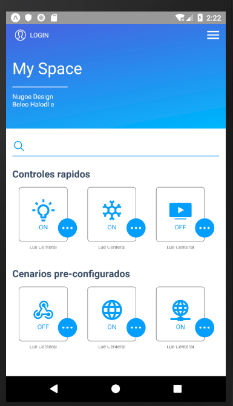

<h1 align="center"><b> Home Automation App</b> </h1>

<h1 align="center">
   
  <kbd>
    
  </kbd>
   
    
</h1>

Bluetooth Automation is used to remotely control devices with serial HC-05 or HC-06 Bluetooth Module.

<i>"How to save a life?" - The Home Automation</i> 

  
  
  
  

  <a href="#blush-overview">Overview</a> •
  <a href="#dizzy-roadmap">Roadmap</a> •
  <a href="#wrench-install-instructions">Install</a> •
  <a href="#zap-tech-stack">Tech Stack</a> •
  <a href="#iphone-Test">Test</a> •
  <a href="#eyes-version">Version</a> •

  <kbd>
    
  </kbd>
  &nbsp;&nbsp;&nbsp;&nbsp;
  <kbd>
    
  </kbd>
  &nbsp;&nbsp;&nbsp;&nbsp;
  <kbd>
    
  </kbd>
    
  <kbd>
    
  </kbd>
    &nbsp;&nbsp;&nbsp;&nbsp;
  <kbd>
    
  </kbd>
    &nbsp;&nbsp;&nbsp;&nbsp;
  <kbd>
    
  </kbd>

## :blush: **Overview?**

FEATURES:
- Auto connectivity with last selected Bluetooth device.
- By, Long pressing of any button You can set Sending Commands and define response Commands to display feedback in App.
- Switch name can be changeable.
-Keep Screen on/off option.
- Remove Ads Option.

DEFAULT COMMANDS:
- Switch1: ON sent 'A' OFF sent 'a'
- Switch2: ON sent 'B' OFF sent 'b'
- Switch3: ON sent 'C' OFF sent 'c'
- Switch4: ON sent 'D' OFF sent 'd'
- Switch5: ON sent 'E' OFF sent 'e'
- Switch6: ON sent 'F' OFF sent 'f'
- Switch7: ON sent 'G' OFF sent 'g'
- Switch8: ON sent 'H' OFF sent 'h'
- All Devices: ON sent '@' OFF sent '#'

By Default, If app get same reply as sent over Bluetooth then app will display a feedback.

## :dizzy: **Roadmap**

-   [ ] Make it work on IOS
-   [x] Make it work on Android
-   [x] Transform into responsive
-   [x] WIFI SWITCH
-   [ ] Update to latest React Native version

## :wrench: **Install instructions**

### Getting Started

#### 1) Clone & Install Dependencies

- 1.1) `git clone https://github.com/funnyjerry/react-native-homeautomation-app.git`
- 1.2) `cd react-native-homeautomation-app` - cd into your newly created project directory.
- 1.3) Install NPM packages with `yarn install`
        **Note:** NPM has issues with React Native so `yarn` is recommended over `npm`.
- 1.4) **[iOS]** `cd ios` and run `pod install` - if you don't have CocoaPods you can follow [these instructions](https://guides.cocoapods.org/using/getting-started.html#getting-started) to install it.
- 1.5) **[Android]** If you haven't already generated a `debug.keystore` file you will need to complete this step from within the `/android/app` folder. Run `keytool -genkey -v -keystore debug.keystore -storepass android -alias androiddebugkey -keypass android -keyalg RSA -keysize 2048 -validity 10000`

#### 2) Start your app

- 2.1) **[iOS]** Build and run the iOS app, run `react-native run-ios` (to run on simulator) or `react-native run-ios --device` (to run on real device) from the root of your project. The first build will take some time.
- 2.2) **[Android]** If you haven't already got an android device attached/emulator running then you'll need to get one running (make sure the emulator is with Google Play / APIs). When ready run `react-native run-android` from the root of your project.

## :zap: **Tech Stack**

<h1 align="center">
  
  
  
   
</h1>

-   [React Native](https://github.com/facebook/react-native)
-   [Eslint](https://eslint.org/)
-   [Android WIFI](https://github.com/devstepbcn/react-native-android-wifi)

## :iphone: **Test**

- [x] Test on Android
- [ ] Test on iOS

## :eyes: **Version**
- [ ] React-Native 0.57.1
- [ ] Expo 